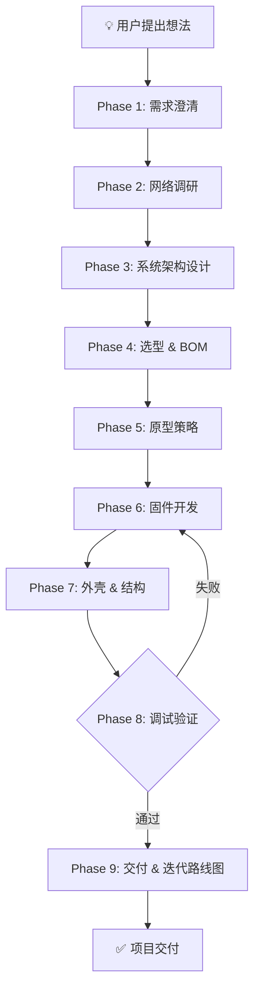
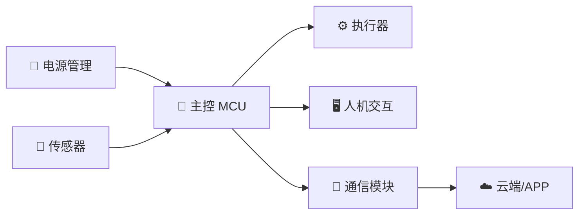

# 硬件 DIY 项目全流程：从 Idea 到 Prototype

## 触发条件

用户在以下场景时自动加载此 skill：
- 提出硬件/电子/IoT 创作想法（"我想做个..."）
- 需要硬件选型或方案对比建议
- 项目需要完整的 BOM 或架构设计
- 涉及单片机、传感器、电路、机械结构

触发关键词：*做*/*设计*/*开发*/*硬件*/*电路*/*传感器*/*单片机*/*嵌入式*/*PCB*/*原型*/*焊接*/*3D打印*/*外壳*

---

## 工作流程总览



---

## Phase 1: 需求澄清

**必须先追问，不得跳过。** 至少覆盖以下维度：

| 维度 | 追问示例 |
|------|----------|
| **功能目标** | 核心功能是什么？期望达到什么效果？有哪些功能是必须的 vs 锦上添花？ |
| **使用场景** | 室内/室外？固定/移动？工作温度范围？是否需要防水防尘？ |
| **供电方式** | USB供电 / 电池（18650/锂电）/ 市电？续航要求？ |
| **交互方式** | 有屏/无屏？按键/APP/Web/语音？ |
| **通信需求** | WiFi/BLE/LoRa/Sub-1G/Zigbee/有线？通信距离？ |
| **技能水平** | 焊接经验？编程水平（Arduino/ESP-IDF/STM32Cube）？PCB设计经验？ |
| **预算 & 时间** | 材料预算？希望多久出原型？ |

输出：结构化的 `requirements.md`

---

## Phase 2: 网络调研

根据需求执行 **至少 3 次 websearch**，覆盖：

1. **同类项目调研** — 搜索 GitHub/开源社区类似项目，分析架构和方案
2. **核心芯片/模组选型对比** — 至少对比 2-3 种方案（如 ESP32 vs RP2040 vs STM32）
3. **关键技术可行性** — 验证核心技术点的可用性和成熟度

补充搜索方向：
- 器件供货情况（嘉立创/某宝/某东 是否有货）
- 参考教程和开源代码仓库
- 成本估算（量产预估 vs 单件成本）

输出：`research-report.md`，包含方案对比表 + 推荐路线 + 风险提示

---

## Phase 3: 系统架构设计

### 3.1 系统框图
用 mermaid 绘制完整系统框图，示例如下：



### 3.2 方案选型
明确以下架构决策：

| 决策项 | 方案选项 | 选择依据 |
|--------|----------|----------|
| **主控** | ESP32 / STM32 / RP2040 / Arduino | 性能、外设、生态、成本 |
| **传感器** | 数字/模拟/I2C/SPI | 精度、功耗、接口 |
| **通信** | BLE/WiFi/LoRa/Sub-1G | 距离、速率、功耗 |
| **供电** | USB/锂电池/18650/太阳能 | 续航、成本、体积 |
| **软件** | Arduino/ESP-IDF/Micropython/FreeRTOS | 开发效率、实时性、生态 |

### 3.3 接口定义
明确各模块之间的接口协议（I2C 地址、SPI 引脚、UART 波特率等）

输出：`architecture.md`

---

## Phase 4: 选型 & BOM 清单

生成完整 BOM，**必须包含以下字段**：

```
类别 | 序号 | 位号 | 名称 | 型号/MPN | 制造商 | 封装 | 数量 | 单价(¥) | 总价(¥) | 渠道 | 生命周期 | 替代型号 | 备注
```

### BOM 分组标准

| 分组 | 说明 |
|------|------|
| **主控 & 核心模组** | 开发板、核心板、主控芯片 |
| **传感器** | 所有输入类器件 |
| **执行器** | 电机、继电器、LED、蜂鸣器、屏幕 |
| **电源** | 电池、LDO/DCDC、充电管理 |
| **无源器件** | 电阻、电容、电感（须标注封装 0603/0805/1206） |
| **连接器** | 排针排母、端子、USB座、FPC |
| **结构件** | 螺丝、铜柱、外壳、支架 |
| **工具耗材** | 杜邦线、焊锡、热缩管、面包板 |

### BOM 规范
- **所有器件标注购买渠道**（嘉立创/某宝/DigiKey/Mouser），优先国内现货
- **标注生命周期状态**（活跃/NRND/EOL）
- **给出替代型号（AVL）**，至少 1 个备选
- 区分 **MVP 必需件** vs **可选升级件**
- 列明 **工具需求**（如烙铁、万用表、热风枪、示波器）

输出：`hardware/bom.csv` + `hardware/bom-summary.md`

---

## Phase 5: 原型策略

根据项目复杂度和用户技能推荐原型路线：

| 阶段 | 方式 | 适合场景 | 耗时 |
|------|------|----------|------|
| **P1 面包板** | 面包板 + 杜邦线 | 快速验证电路、学习调试 | 1-3天 |
| **P2 万用板** | 洞洞板 + 焊接 | 半永久原型、体积不大 | 3-7天 |
| **P3 PCB打样** | KiCad/EasyEDA → 嘉立创 | 稳定可靠、小型化 | 7-14天 |
| **P4 小批量** | SMT贴片 + 钢网 | 10-100片测试 | 14-30天 |

决策建议：**先走 P1 验证核心功能**，再决定是否投 PCB。

---

## Phase 6: 固件开发

### 项目骨架

```
firmware/
├── src/
│   ├── main.cpp             # 主程序入口
│   ├── config.h             # 引脚定义 & 配置宏
│   ├── sensors.cpp/.h       # 传感器驱动
│   ├── actuators.cpp/.h     # 执行器控制
│   ├── communication.cpp/.h # 通信处理
│   └── utils.cpp/.h         # 工具函数
├── lib/                     # 第三方库
├── platformio.ini           # 或 CMakeLists.txt / Arduino .ino
└── test/                    # 单元测试
```

### 代码规范
- **禁止 `delay()` 阻塞** — 使用 `millis()` 或定时器实现非阻塞
- **引脚定义统一放 `config.h`**，用 `#define` 或 `constexpr`
- **硬件抽象层（HAL）** — 同一接口适配不同板型
- **状态机** — 复杂逻辑用 enum FSM 而非嵌套 if/else
- **错误处理** — 传感器读取失败须有 fallback 机制
- **看门狗** — 关键系统启用 WDT 防死机

### 开发平台推荐
| 平台 | 适用芯片 | 推荐 IDE |
|------|----------|----------|
| Arduino | AVR, ESP32, RP2040, STM32 | VS Code + PlatformIO |
| ESP-IDF | ESP32-S3/C3/H2 | VS Code + ESP-IDF插件 |
| Micropython | ESP32, RP2040 | Thonny / rshell |
| STM32Cube | STM32全系 | STM32CubeIDE |

输出：完整可编译的固件骨架代码

---

## Phase 7: 外壳 & 结构设计

| 方式 | 推荐工具 | 适用场景 |
|------|----------|----------|
| **3D打印** | OpenSCAD / Fusion 360 / Tinkercad | 定制外壳、复杂曲面 |
| **激光切割** | LightBurn / Inkscape | 亚克力/木板平板外壳 |
| **成品盒** | 某宝防水盒/铝合金壳 | 快速封装、IP防护 |
| **标准乐高/铝型材** | - | 原型框架快速搭建 |

输出：`enclosure/` 目录下设计源文件或推荐成品壳链接

---

## Phase 8: 调试验证

### 调试优先级协议
1. **电源检查**（先做！） — 万用表测供电电压是否正常
2. **地线连续性** — 所有模块共地
3. **信号验证** — 示波器/逻辑分析仪测 I2C/SPI/UART 波形
4. **组件隔离** — 逐一断开模块确认故障源
5. **软硬分离** — 跑 Blink 例程确认硬件没问题，再排软件

### 常见失败模式
| 问题 | 排查方向 |
|------|----------|
| 不上电 | 电源反接 / LDO 损坏 / 短路 |
| 不通信 | I2C地址冲突 / 电平不匹配 / 上拉电阻缺失 |
| 读数异常 | ADC参考电压不对 / 信号线干扰 |
| 无故重启 | 供电不足 / WDT复位 / 内存溢出 |
| 手机搜不到 | 天线未匹配 / 射频认证 / 功率配置 |

### MVP 验收标准
- [ ] 核心功能完整跑通
- [ ] 连续运行 1 小时无死机
- [ ] BOM 清单确认可购
- [ ] 硬件接线图/原理图已完成
- [ ] README 文档完整

---

## Phase 9: 交付 & 迭代路线

最终交付物清单：
- `README.md` — 项目总览
- `docs/requirements.md` — 需求文档
- `docs/architecture.md` — 系统架构
- `docs/research-report.md` — 调研报告
- `hardware/bom.csv` — BOM 清单
- `firmware/` — 固件源码（可编译）
- `enclosure/` — 外壳设计文件（如有）
- `docs/next-steps.md` — 后续迭代建议（量产化/认证/APP开发）

---

## 核心原则

1. **先问再做** — 需求模糊时绝不直接出方案
2. **搜了再写** — 方案必须有 websearch 调研支撑
3. **BOM 可购** — 所有器件标注国内可购买渠道
4. **代码可编** — 生成代码必须是语法正确的可编译骨架
5. **优先开源** — 优先推荐开源硬件/软件，降低门槛和成本
6. **MVP 先行** — 先跑通最小可行原型，再迭代优化
7. **替代方案** — 关键器件至少给 1 个替代型号，防缺货
